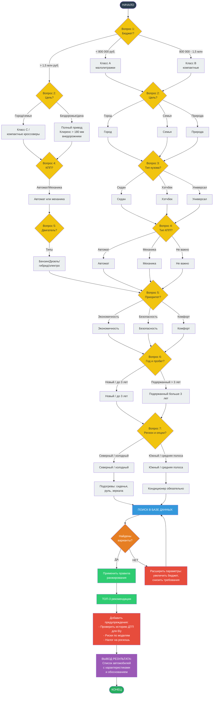

```mermaid
graph TD
    %% Уровень 1: Начало
    Start([НАЧАЛО]) --> Q1
    
    %% Уровень 2: Вопрос о бюджете
    Q1{Вопрос 1:<br>Бюджет?}
    Q1 -->|< 800 000 руб.| ClassA[Класс A<br>малолитражки]
    Q1 -->|800 000 - 1,5 млн| ClassB[Класс B<br>компактные]
    Q1 -->|> 1,5 млн руб.| Q2_High
    
    %% Уровень 3: Вопрос о цели для высокого бюджета
    Q2_High{Вопрос 2:<br>Цель?} -->|Город/семья| ClassC[Класс C /<br>компактные кроссоверы]
    Q2_High -->|Бездорожье/дача| Offroad[Полный привод<br>Клиренс > 180 мм<br>внедорожники]
    
    %% Уровень 3: Для эконом и среднего бюджета
    ClassA --> Q2_Low
    ClassB --> Q2_Low
    
    Q2_Low{Вопрос 2:<br>Цель?} -->|Город| City
    Q2_Low -->|Семья| Family
    Q2_Low -->|Природа| Nature
    
    City[Город] --> Q3
    Family[Семья] --> Q3
    Nature[Природа] --> Q3
    
    ClassC --> Q4_Off
    Offroad --> Q4_Off
    
    %% Уровень 4: Вопрос о типе кузова
    Q3{Вопрос 3:<br>Тип кузова?} -->|Седан| Sedan[Седан]
    Q3 -->|Хэтчбек| Hatch[Хэтчбек]
    Q3 -->|Универсал| Universal[Универсал]
    
    Sedan --> Q4
    Hatch --> Q4
    Universal --> Q4
    
    %% Уровень 4: Вопрос о КПП для бездорожья
    Q4_Off{Вопрос 4:<br>КПП?} -->|Автомат/Механика| AT_Off[Автомат или механика]
    AT_Off --> Q5_Off
    
    %% Уровень 5: Вопрос о двигателе для бездорожья
    Q5_Off{Вопрос 5:<br>Двигатель?} -->|Типы| Engine[Бензин/Дизель/<br>гибрид/электро]
    Engine --> Q5
    
    %% Уровень 5: Вопрос о КПП
    Q4{Вопрос 4:<br>Тип КПП?} -->|Автомат| AT[Автомат]
    Q4 -->|Механика| MT[Механика]
    Q4 -->|Не важно| Any[Не важно]
    
    AT --> Q5
    MT --> Q5
    Any --> Q5
    
    %% Уровень 6: Вопрос о приоритетах
    Q5{Вопрос 5:<br>Приоритет?} -->|Экономичность| Eco[Экономичность]
    Q5 -->|Безопасность| Safe[Безопасность]
    Q5 -->|Комфорт| Comfort[Комфорт]
    
    Eco --> Q6
    Safe --> Q6
    Comfort --> Q6
    
    %% Уровень 7: Вопрос о возрасте авто
    Q6{Вопрос 6:<br>Год и пробег?} -->|Новый / до 3 лет| New[Новый / до 3 лет]
    Q6 -->|Подержанный > 3 лет| Used[Подержанный больше 3 лет]
    
    New --> Q7
    Used --> Q7
    
    %% Уровень 8: Вопрос о регионе
    Q7{Вопрос 7:<br>Регион и опции?} -->|Северный / холодный| North[Северный / холодный]
    Q7 -->|Южный / средняя полоса| South[Южный / средняя полоса]
    
    North --> Heat[Подогревы: сиденья,<br>руль, зеркала]
    South --> Cond[Кондиционер обязательно]
    
    %% Уровень 9: Поиск в БД
    Heat --> Search[ПОИСК В БАЗЕ ДАННЫХ]
    Cond --> Search
    
    %% Уровень 10: Проверка результатов
    Search --> Found{Найдены<br>варианты?}
    
    Found -->|ДА| Rank[Применить правила<br>ранжирования]
    Found -->|НЕТ| Expand[Расширить параметры:<br>увеличить бюджет,<br>снизить требования]
    
    Expand --> Search
    
    %% Уровень 11: Рекомендации
    Rank --> Top3[ТОП-3 рекомендации]
    
    %% Уровень 12: Предупреждения - ИСПРАВЛЕНО (убраны скобки)
    Top3 --> Warnings[Добавить предупреждения:<br>- Проверить историю ДТП для б/у<br>- Риски по моделям<br>- Налог на роскошь]
    
    %% Уровень 13: Вывод результата
    Warnings --> Result[ВЫВОД РЕЗУЛЬТАТА:<br>Список автомобилей<br>с характеристиками<br>и обоснованием]
    
    Result --> Finish([КОНЕЦ])
    
    %% Стилизация для наглядности
    style Start fill:#2c3e50,color:#fff
    style Finish fill:#27ae60,color:#fff
    style Q1 fill:#f1c40f
    style Q2_Low fill:#f1c40f
    style Q2_High fill:#f1c40f
    style Q3 fill:#f1c40f
    style Q4 fill:#f1c40f
    style Q4_Off fill:#f1c40f
    style Q5 fill:#f1c40f
    style Q5_Off fill:#f1c40f
    style Q6 fill:#f1c40f
    style Q7 fill:#f1c40f
    style Search fill:#3498db,color:#fff
    style Found fill:#e67e22,color:#fff
    style Rank fill:#2ecc71,color:#fff
    style Top3 fill:#2ecc71,color:#fff
    style Warnings fill:#e74c3c,color:#fff
    style Result fill:#9b59b6,color:#fff
    style Expand fill:#e74c3c,color:#fff
    
    %% Стили для узлов-ответов
    style ClassA fill:#ecf0f1
    style ClassB fill:#ecf0f1
    style ClassC fill:#ecf0f1
    style Offroad fill:#ecf0f1
    style City fill:#ecf0f1
    style Family fill:#ecf0f1
    style Nature fill:#ecf0f1
    style Sedan fill:#ecf0f1
    style Hatch fill:#ecf0f1
    style Universal fill:#ecf0f1
    style AT fill:#ecf0f1
    style MT fill:#ecf0f1
    style Any fill:#ecf0f1
    style AT_Off fill:#ecf0f1
    style Engine fill:#ecf0f1
    style Eco fill:#ecf0f1
    style Safe fill:#ecf0f1
    style Comfort fill:#ecf0f1
    style New fill:#ecf0f1
    style Used fill:#ecf0f1
    style North fill:#ecf0f1
    style South fill:#ecf0f1
    style Heat fill:#ecf0f1
    style Cond fill:#ecf0f1
```
