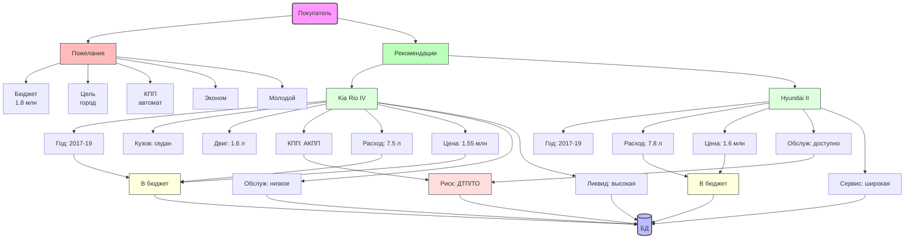

```mermaid
graph TD
    %% Уровень 1: Покупатель
    P(Покупатель)
    
    %% Уровень 2: Основные ветки
    P --> PB[Пожелания]
    P --> R[Рекомендации]
    
    %% Уровень 3: Детализация пожеланий (компактно)
    PB --> B1[Бюджет<br>1.8 млн]
    PB --> B2[Цель<br>город]
    PB --> B3[КПП<br>автомат]
    PB --> B4[Эконом]
    PB --> B5[Молодой]
    
    %% Уровень 3: Автомобили
    R --> K[Kia Rio IV]
    R --> H[Hyundai II]
    
    %% Уровень 4: Характеристики Kia (в две строки)
    K --> K1[Год: 2017-19]
    K --> K2[Кузов: седан]
    K --> K3[Двиг: 1.6 л]
    K --> K4[КПП: АКПП]
    K --> K5[Расход: 7.5 л]
    K --> K6[Цена: 1.55 млн]
    K --> K7[Обслуж: низкое]
    K --> K8[Ликвид: высокая]
    
    %% Уровень 4: Характеристики Hyundai (в две строки)
    H --> H1[Год: 2017-19]
    H --> H2[Расход: 7.8 л]
    H --> H3[Цена: 1.6 млн]
    H --> H4[Обслуж: доступно]
    H --> H5[Сервис: широкая]
    
    %% Уровень 5: Обоснование и риски (компактно)
    K1 --> O1[В бюджет]
    K5 --> O1
    K6 --> O1
    
    H2 --> O2[В бюджет]
    H3 --> O2
    
    K4 --> R1[Риск: ДТП/ТО]
    H4 --> R1
    
    %% Уровень 6: База знаний (центр)
    O1 --> DB[(БД)]
    O2 --> DB
    R1 --> DB
    K7 --> DB
    K8 --> DB
    H5 --> DB
    
    %% Стили для компактности
    style P fill:#f9f,stroke:#333,stroke-width:2px
    style DB fill:#bbf,stroke:#333,stroke-width:2px
    style R fill:#bfb,stroke:#333
    style PB fill:#fbb,stroke:#333
    style K fill:#dfd,stroke:#333
    style H fill:#dfd,stroke:#333
    style O1 fill:#ffd,stroke:#333
    style O2 fill:#ffd,stroke:#333
    style R1 fill:#fdd,stroke:#333
```
