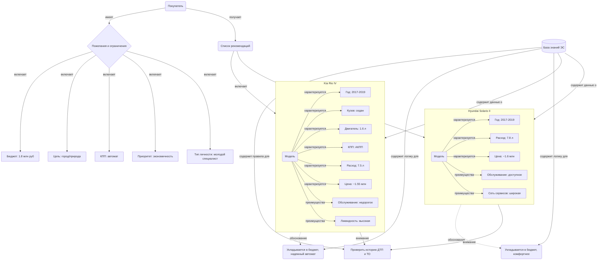

```mermaid
graph TD
    %% Покупатель (центр верхней части)
    P(Покупатель) -->|имеет| PB{Пожелания и ограничения}
    
    %% Левая ветка - характеристики покупателя
    PB -->|включает| B1[Бюджет: 1.8 млн руб]
    PB -->|включает| B2[Цель: город/природа]
    PB -->|включает| B3[КПП: автомат]
    PB -->|включает| B4[Приоритет: экономичность]
    PB -->|включает| B5[Тип личности: молодой специалист]
    
    %% Центральная часть - результат рекомендации
    P -->|получает| R(Список рекомендаций)
    
    %% Правая верхняя ветка - первый автомобиль
    subgraph KIA [Kia Rio IV]
        K1(Модель) 
        K1 -->|характеризуется| K11[Год: 2017-2019]
        K1 -->|характеризуется| K12[Кузов: седан]
        K1 -->|характеризуется| K13[Двигатель: 1.6 л]
        K1 -->|характеризуется| K14[КПП: АКПП]
        K1 -->|характеризуется| K15[Расход: 7.5 л]
        K1 -->|характеризуется| K16[Цена: ~1.55 млн]
        K1 -->|преимущества| K17[Обслуживание: недорогое]
        K1 -->|преимущества| K18[Ликвидность: высокая]
    end
    
    %% Правая нижняя ветка - второй автомобиль
    subgraph HYUNDAI [Hyundai Solaris II]
        H1(Модель)
        H1 -->|характеризуется| H11[Год: 2017-2019]
        H1 -->|характеризуется| H12[Расход: 7.8 л]
        H1 -->|характеризуется| H13[Цена: ~1.6 млн]
        H1 -->|преимущества| H14[Обслуживание: доступное]
        H1 -->|преимущества| H15[Сеть сервисов: широкая]
    end
    
    %% Связь рекомендаций с автомобилями
    R -->|включает| KIA
    R -->|включает| HYUNDAI
    
    %% Нижняя часть - обоснование, риски и БД
    KIA -.->|обоснование| O1(Укладывается в бюджет, надежный автомат)
    HYUNDAI -.->|обоснование| O2(Укладывается в бюджет, комфортнее)
    
    KIA -->|внимание| Risk[Проверить историю ДТП и ТО]
    HYUNDAI -->|внимание| Risk
    
    %% База знаний в самом низу как единый источник
    DB[(База знаний ЭС)] -->|содержит данные о| KIA
    DB -->|содержит данные о| HYUNDAI
    DB -->|содержит правила для| Risk
    DB -->|содержит логику для| O1
    DB -->|содержит логику для| O2
```
